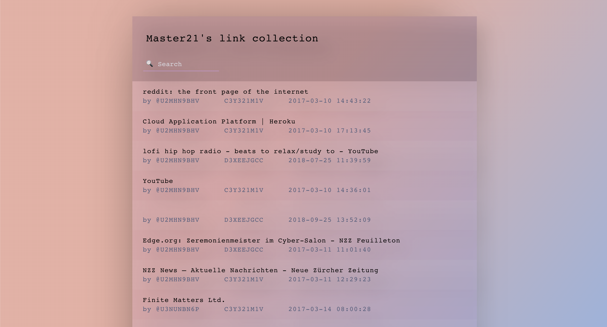
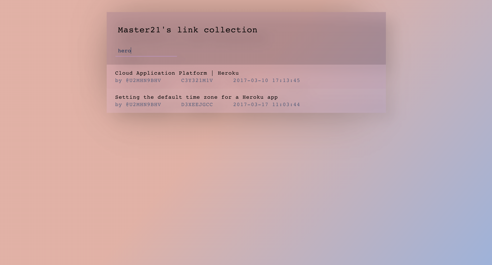
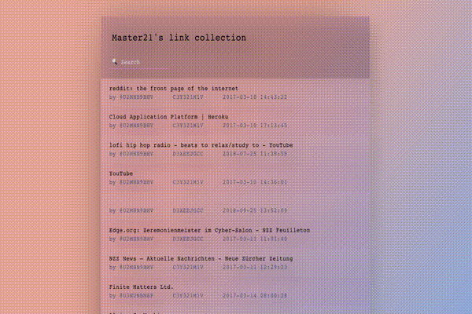

# This is the list interface for my slack bot. It is a bot which collects all shared links. The Backend and the related documentation can be found [here](https://github.com/nuritnt/tntbot).

## This project was build as the final project during the fulltime master12 academy bootcamp in 2017. It is no longer maintained, nor hosted on Heroku.

### Since it is no longer hosted on heroku, here are some screenshots of how the collection looked:

### The list has
* title
* url
* posted data
* channel id
* user id

### To do
* format timestamp
* fix channel id
* fix user id
